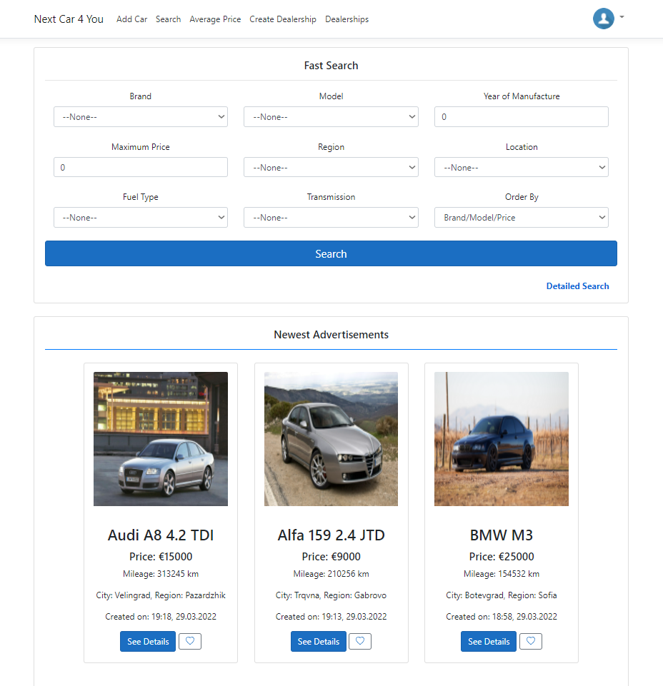
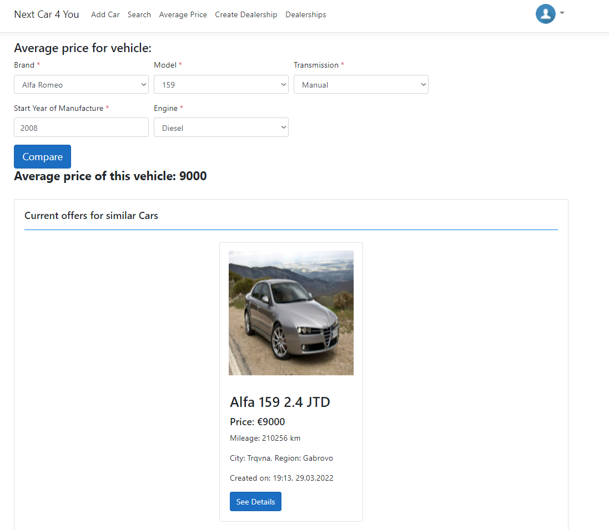

# NextCarForYou
• The current project represents an application which gives the opportunity to manage advertisements for vehicles for sale. 
• You can add / edit / delete advertisements, as well as search concrete vehicles by given criteria.  
• An advertisements can have related images and shows all the information about the current vehicle.  
• The application provides information for the latest published advertisements.  
• You can add any advertisement to favorite so you can easily track the updates for it.  
• If you own car dealership/s, you have the opportunity to create ones and relate all of your advertisements to the car dealership.  
• You can check average price for any vehicle by given parameters such as brand, model, year and etc.  
• There is a contact form for any suggestions, questions or issues.

Used technologies:
•ASP.NET Core 5.0 
•EF Core 5.0 
•MS SQL 
•AutoMapper 
•Bootstrap 
•AJAX 

Welcome page
When users visit our home page they can do quick search and they can see the latest published advertisements.

The users are able to do fast search by specifying different criterions for example:

The result/s are filtered by the entered information. Short information is listed about every advertisement.

The users are able to do detailed search of published advertisements by specifying additional criterions.

In order to add advertisement the user need to register in the system:

After the user is done with registration then he can add an advertisement by clicking the Add button in navigation bar.
The information is separated in two steps in different sections. The first step contains information about the basic data, technical data and extras related to the vehicle.
For the second step a name of the advertisement and description can be entered. The user is able to add one or more images as well.

After clicking finish the advertisement is published and visible for the rest of the users.
Users can update or delete their own advertisements.

User has a quick menu on the top right (profile icon).

When user clicks on My Advertisements he can see all of his own published advertisements.

Users are able to add any of the advertisements to favorite and track them easily.

Everyone of the users can see the average price of any vehicle by specified parameters.

If you have your own car dealership, then you are able to register it in the system and link all of your advertisements to it.

